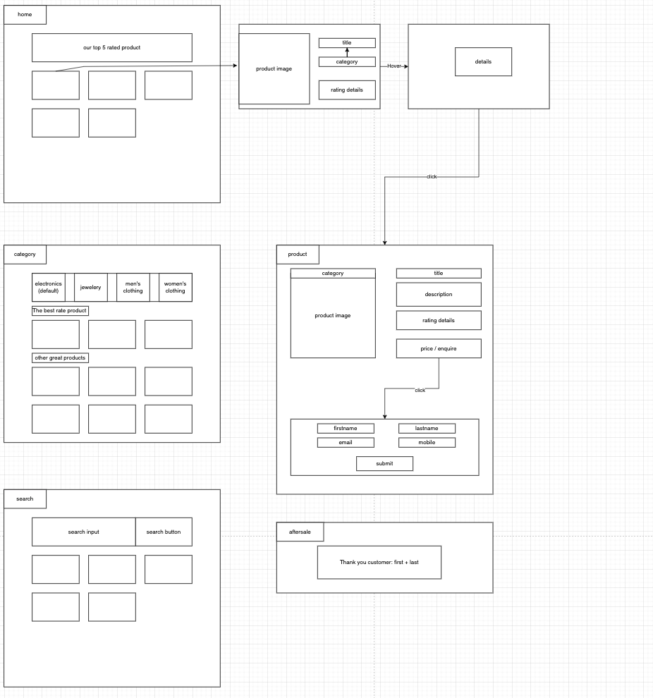

#### officeworks fullstack code test

[Requests](https://bitbucket.org/ow-online/test-wayne-zhang/src/master/)

Author: Wayne

How to run this locally:
1. You need to `~/backend/src/model/productModel.js` -> line: 84. Replace the email address with other email address.
2. At the same file, line: 86 ~ 93, kindly register or use your gmail to register a app use password.
3. Create a `.env` under `~/backend/` and paste the 16 digits password, format looks like `AUTH_EMAIL_PASSWORD = 16 digits pwd`
4. Under `/backend` please run `npm run dev / npm run start` Backend on port 4000
5. Under `/frontend` please run `npm run start` Front on port 3000

Frontend plan:
  It will cover only simple CSS and UX, more focused on Form control and multi-pages
  Design:
  

Backend plan:
  Backend should use Express due to OW majorly use express daily. I prefer to separate the backend into few components and folders. It includes: model, controller, routes and utility combined of all necessary and reuseable helper or functions.
  I would prefer axios to call fakestore APIs. It can create an instance which will make the code more clean and expandable with same base url, also easier to swap to other store APIs and make the app more maintainable.
  
  my APIs list
  1. x Get all products. (ordered by rate from high to low) 
  2. x Get top 5 rated products. (Homepage)
  3. x Get categories. (Category page)
  4. x Get products from single category. (Category page)
  5. x Get search result, it should use a filter to find matched result from No.1 all products api response.
  6. x Get product detail by product id. (Product page)
  7. x Post customer details, trigger mail system to sale person. (Enquiry page / Product page)